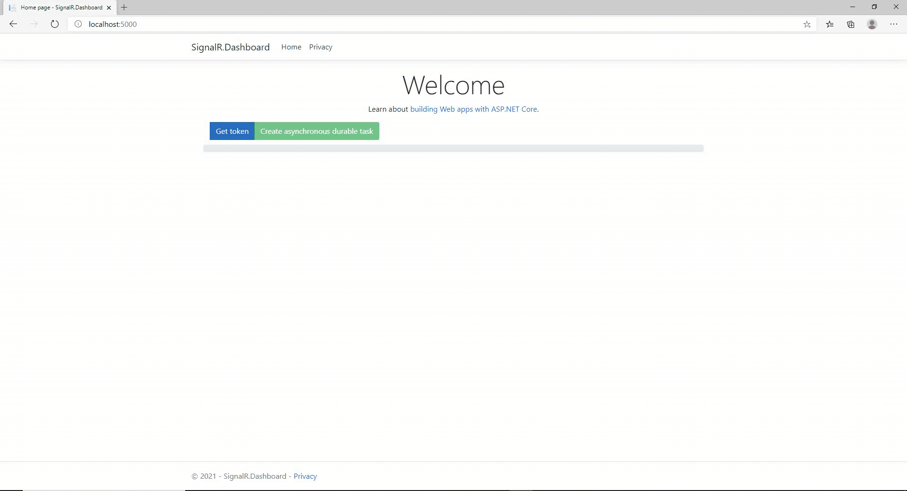

# azure-signalr-dashboard

Demo - setup instructions:

1. Create an Azure SignalR resource.
https://docs.microsoft.com/en-us/azure/azure-signalr/signalr-quickstart-dotnet-core

2. Open the local.settings.json file and replace the variable: AZURE_SIGNALR_CONNECTION_STRING with the Azure SignalR connection string.
```
{
  "IsEncrypted": false,
  "Values": {
    "AzureWebJobsStorage": "UseDevelopmentStorage=true",
    "FUNCTIONS_WORKER_RUNTIME": "dotnet",
    "AzureSignalRConnectionString": "AZURE_SIGNALR_CONNECTION_STRING"
  },
  "Host": {
    "CORS": "http://localhost:5000",
    "CORSCredentials": true
  }
}
```

Demo - run instructions:

1. Open Visual Studio and start the following projects: SignalR.Dashboard and SignalR.Dashboard.Function.

2. Press the button: "Get token".
Note: In this step we simulate the user authentication and then received a jwt token that will be used by SignalR to secure the communication.

3. Press the button: "Create asynchronous durable task".
Note: In this step we launch the orchestration process that will be simulating the following tasks: record creation, group creation, welcome mail submission, creator notification.
All these are fake methods that simulate a custom processing in the backend.

4. You will be able to see the advance in the progress bar and the custom messages sent by the orchestrator to the user.

